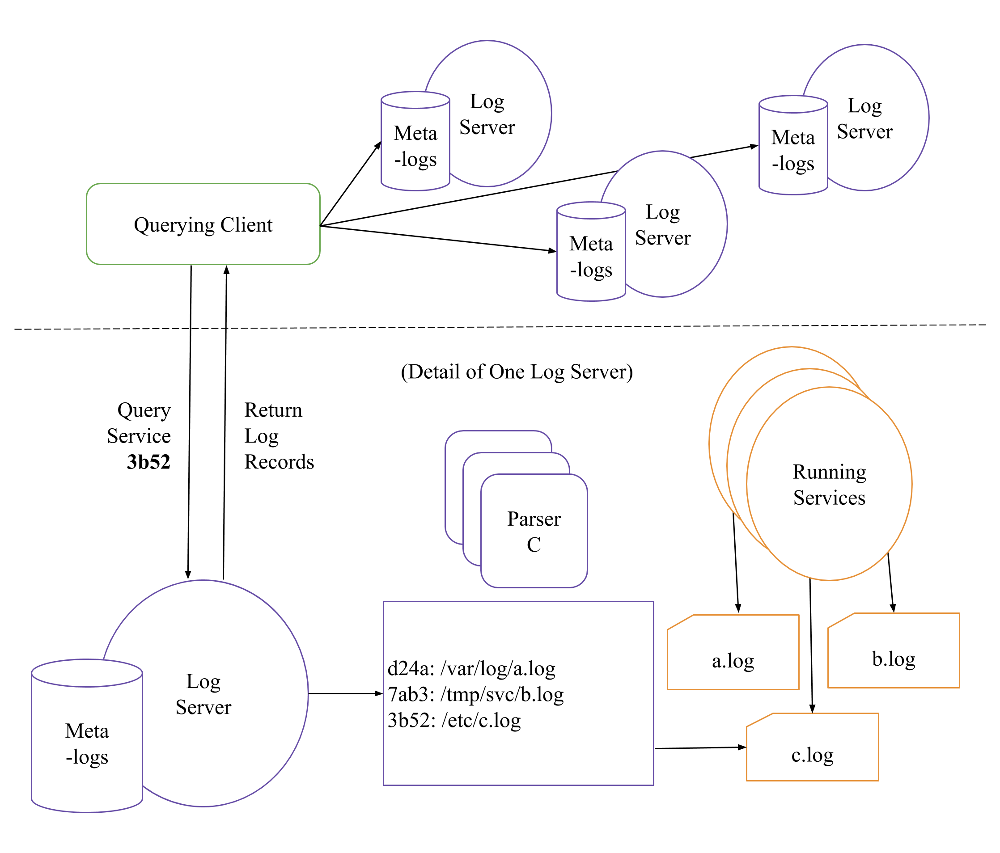

# TLQ: Troubleshooting via Loq Query
TLQ is a platform for troubleshooting _open_ distributed systems. It provides users with the ability to submit queries to debug logs generated across a distributed system. There are two key terms we need to discuss to understand how TLQ works: open distributed systems and distributed queries.

### What is an open distributed system?
We define an open distributed system as a set of computing resources whose membership in a cluster, cloud, or grid may not be permanent, which are assigned computations at runtime (i.e. the system _and_ user do not know in advance which computations will be scheduled where), and may consist of cross-domain resources (e.g. resources coming from multiple cloud providers, campus clusters, and national-scale infrastructures) which span _independent_ organizational jurisdictions.

### Why use distributed queries?
Rather than collect all debug output at a single node (which is a common practice of other distributed systems debuggers), TLQ keeps each log in place on the machine which created it. On one hand, this is due to the complexity of open distributed systems. Again, we do not know where logs will exist (and potentially what those logs may be named or how to reach them). Because of this, we cannot collect every log which may be relevant in one place. Further, if the system spans multiple jurisdictions, it may be impractical to transfer logs from one jurisdiction to another. Lastly, the system may generate an _enormous_ amount of debug output. It is more efficient, both in terms of runtime and in cost, in many cases to ask a query of only the relevant debug output (where it lives) than to collect a large amount of unneeded output in one place.

## Architecture

TLQ has two main components: a querying client and a set of log servers. The client is where the user writes and submits queries to their logs. The log servers watch each log they are told about and evaluate queries submitted to them by clients. As services run on the system and produce logs, they may tell their local log server about them as well as the client. This is necessary to ensure both the user and TLQ know how to reach a given log (this is currently accomplished by way of a wrapper script called `log_define`). Each logged tracked by a log server is parsed (from a set of parsers given to TLQ by developers) to create metalogs. These metalogs are JSON documents which give a high-level overview of the content in each log. These can be queried more quickly if a user does not want to commit to searching through a potentially large log file before knowing if it is relevant or not.

## Installation
To install TLQ, you need only run `make build` at the top level TLQ directory. This will pull the necessary Perl modules as well as the CCTools software repository (a critical dependency). This TLQ repository comes with two example systems out of the box: a short text analysis workflow and the Lifemapper biodiversity workflow.

### Dependencies
TLQ requires a local installation of Perl 5. It will automatically retrieve the necessary modules from cpan in the Makefile.

CCTools is automatically installed at the top-level TLQ directory when running `make build`. CCTools provides the Work Queue master-worker framework software and the Makeflow workflow management system, both of which are necessary to run Lifemapper. It also provides a simple interface to the HTCondor batch system, which is the default configured batch system for this repository. Finally, CCTools provides the JX (JSON eXtended) language which can be used to query the metalogs at each log server.

## Running TLQ
This repository of TLQ is fairly bare-bones. Log servers and the client must be started manually _before_ executing the system of your choice. At the user-end, you will need to run the client which also receives messages from log servers about which logs the servers are watching:
```
perl tlq_client -s
```

The `-s` option saves any commands you execute for subsequent sessions.

At each machine you want to run a log server, run:
```
perl tlq_server -p 11855
```

You can run each of these three scripts with the `-h` option to see its respective help text.

### Editing configurations
This TLQ repository was written for a specific environment to demonstrate a live version of TLQ for an academic paper. As such, it is highly unlikely to work out of the box for you. You will need to alter the Makefiles within the `shakespeare` and `lifemapper` repositories to set up the proper batch system and username to use to submit work (and clean it up afterward). If your batch system is not HTCondor, this will involve significant changes. For `shakespeare` and `lifemapper`, you will need to alter the `HOME` variable in the `trace.jx` document to the machine you are running the `tlq_client` script.

#### Other Hardcoded Information
```
.
├── lifemapper
|  ├── Makefile (set HOME variable)
|  ├── workers
|    └── workers.submit (home and port in the command variable, expressions in the requirements variable)
|  └── trace.jx (set LTL and TLQDIR variables)
├── shakespeare
|  ├── Makefile (set the HOME variable)
|  ├── workers
|    └── workers.submit (home and port in the command variable, expressions in the requirements variable)
|  └── trace.jx (set LTL and TLQDIR variables)
```

