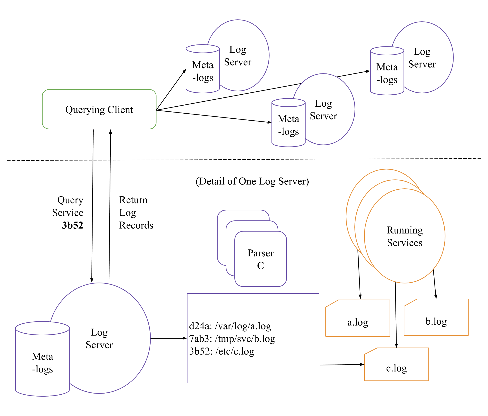

# TLQ: Troubleshooting via Loq Query
TLQ is a platform for troubleshooting _open_ distributed systems. It provides users with the ability to submit queries to debug logs generated across a distributed system. There are two key terms we need to discuss to understand how TLQ works: open distributed systems and distributed queries.

### What is an open distributed system?
We define an open distributed system as a set of computing resources whose membership in a cluster, cloud, or grid may not be permanent, which are assigned computations at runtime (i.e. the system _and_ user do not know in advance which computations will be scheduled where), and may consist of cross-domain resources (e.g. resources coming from multiple cloud providers, campus clusters, and national-scale infrastructures) which span _independent_ organizational jurisdictions.

### Why use distributed queries?
Rather than collect all debug output at a single node (which is a common practice of other distributed systems debuggers), TLQ keeps each log in place on the machine which created it. On one hand, this is due to the complexity of open distributed systems. Again, we do not know where logs will exist (and potentially what those logs may be named or how to reach them). Because of this, we cannot collect every log which may be relevant in one place. Further, if the system spans multiple jurisdictions, it may be impractical to transfer logs from one jurisdiction to another. Lastly, the system may generate an _enormous_ amount of debug output. It is more efficient, both in terms of runtime and in cost, in many cases to ask a query of only the relevant debug output (where it lives) than to collect a large amount of unneeded output in one place.

## Architecture

## Installation

### Dependencies

## Running TLQ

### Editing configurations
